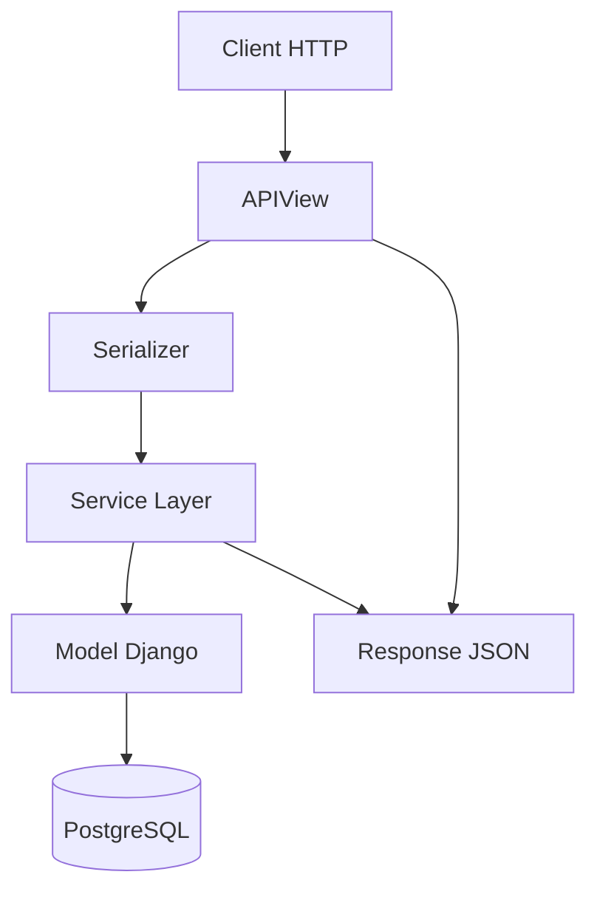
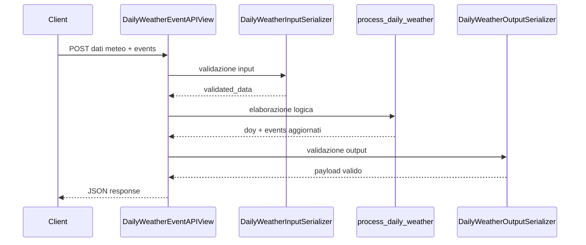
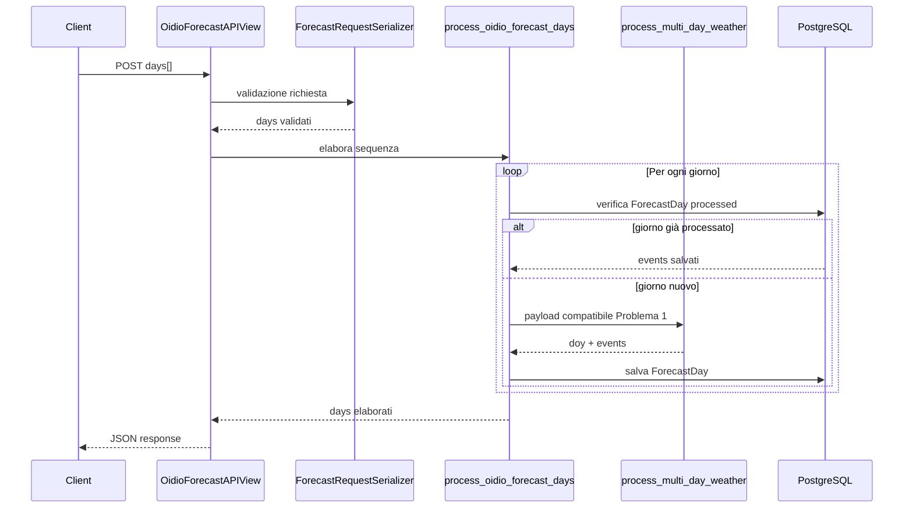

[](https://www.python.org/)
[](https://www.djangoproject.com/)
[](https://www.django-rest-framework.org/)
[](https://www.postgresql.org/)
[](https://www.docker.com/)
[](https://docs.docker.com/compose/)
[](https://uwsgi-docs.readthedocs.io/)
[](https://www.openapis.org/)
[](https://swagger.io/)
[](https://drf-spectacular.readthedocs.io/)

# DJ Weather App

Backend REST sviluppato con **Django** e **Django REST Framework** per simulare l'evoluzione di eventi meteo e la previsione multi-giornaliera del modello Oidio.

Il progetto implementa due parti:

- **Problema 1**: API stateless che riceve dati meteo giornalieri e restituisce l'evoluzione degli eventi.
- **Problema 2**: API multi-giornaliera che usa il Problema 1 come **black-box**, salva i risultati su PostgreSQL e permette di ricostruire nel tempo la storia degli eventi.

Il backend è containerizzato con Docker e usa PostgreSQL come servizio separato.

---

## Indice

1. [Panoramica del progetto](#1-panoramica-del-progetto)
2. [Tecnologie utilizzate](#2-tecnologie-utilizzate)
3. [Architettura del progetto](#3-architettura-del-progetto)
4. [Struttura delle directory](#4-struttura-delle-directory)
5. [Problema 1 - Simulazione eventi meteo](#5-problema-1---simulazione-eventi-meteo)
6. [Problema 2 - Modello Oidio multi-giornaliero](#6-problema-2---modello-oidio-multi-giornaliero)
7. [Scelte progettuali](#7-scelte-progettuali)
8. [Analisi algoritmica e struttura dati](#8-analisi-algoritmica-e-struttura-dati)
9. [Configurazione ed esecuzione](#9-configurazione-ed-esecuzione)
10. [Testing](#10-testing)

---

## 1. Panoramica del progetto

Il progetto nasce come soluzione a un task backend in cui è richiesto di realizzare una REST API Django per simulare l'evoluzione di eventi associati a condizioni agrometeorologiche.

La logica si divide in due livelli.

### Problema 1

Il primo problema richiede una API che riceve, per un singolo giorno, questi dati:

- `doy`: Day Of Year, cioè giorno dell'anno;
- `temperature`: temperatura media giornaliera;
- `bagnatura`: bagnatura fogliare, `0` o `1`;
- `humidity`: umidità media giornaliera;
- `rain`: pioggia cumulata giornaliera;
- `events`: stato precedente degli eventi, opzionale nella prima chiamata.

L'API restituisce il nuovo stato degli eventi nel formato:

```json
{
  "doy": 126,
  "events": [
    { "index": 0, "X": 0.0 }
  ]
}
```

La caratteristica principale è che l'API è **stateless**: il server non conserva internamente gli eventi tra una chiamata e la successiva. Lo stato viene passato dal client tramite il campo `events`.

### Problema 2

Il secondo problema estende il flusso a una sequenza multi-giornaliera. La API riceve:

- 1 giorno storico, cioè l'ultimo giorno completo;
- fino a 7 giorni previsionali;
- lo stato `events` antecedente al primo giorno della sequenza.

Il Problema 2 usa il Problema 1 come **black-box**: non deve dipendere dai dettagli interni della crescita di `X`, ma solo dal formato di input/output.

Per ogni giorno elaborato, il risultato viene salvato nel database PostgreSQL nella tabella `ForecastDay`.

---

## 2. Tecnologie utilizzate

### Linguaggi

| Linguaggio | Uso nel progetto |
|---|---|
| Python | Backend Django, service layer, serializer, test |
| SQL | Persistenza su PostgreSQL tramite ORM Django |
| YAML | Configurazione Docker Compose |
| Shell | Script di avvio containerizzato |

### Framework, librerie e servizi

| Tecnologia | Ruolo |
|---|---|
| Django | Framework web principale |
| Django REST Framework | API REST, serializer, APIView |
| drf-spectacular | Generazione schema OpenAPI e Swagger UI |
| PostgreSQL 17 | Database esterno richiesto dal Problema 2 |
| Docker | Containerizzazione del backend |
| Docker Compose | Orchestrazione backend + database |
| uWSGI | Application server usato nel container |
| python-dotenv | Caricamento variabili da `.env` in sviluppo locale |

---

## 3. Architettura del progetto

L'architettura è organizzata per separare chiaramente:

- livello HTTP;
- validazione;
- business logic;
- persistenza.



### Responsabilità dei livelli

| Livello | File principali | Responsabilità |
|---|---|---|
| Routing | `config/urls.py`, `weather/urls.py` | Espone gli endpoint HTTP |
| View | `weather/views.py` | Riceve la richiesta, valida, delega ai service |
| Serializer | `weather/serializers.py` | Valida input/output e documenta lo schema |
| Service Layer | `weather/services.py` | Contiene le regole di business |
| Model | `weather/models.py` | Definisce la persistenza su PostgreSQL |
| Management command | `db/management/commands/wait_for_db.py` | Attende la disponibilità del database |

La scelta di spostare la logica nel Service Layer evita di avere API View troppo dense e rende le funzioni testabili senza dover passare necessariamente da HTTP.

---

## 4. Struttura delle directory

```text
dj_weather_app/
│
├── manage.py
├── Dockerfile
├── docker-compose.yml
├── .env.example
│
├── config/
│   ├── settings.py
│   ├── urls.py
│   ├── wsgi.py
│   └── asgi.py
│
├── weather/
│   ├── migrations/
│   ├── __init__.py
│   ├── admin.py
│   ├── apps.py
│   ├── models.py
│   ├── serializers.py
│   ├── services.py
│   ├── views.py
│   ├── urls.py
│   └── tests.py
│
└── db/
    └── management/
        └── commands/
            └── wait_for_db.py
```

### `config/`

Contiene la configurazione globale Django:

- `settings.py`: configurazione database, app installate, DRF, OpenAPI, static files e logging;
- `urls.py`: routing principale del progetto;
- `wsgi.py` e `asgi.py`: entrypoint applicativi.

Il routing principale monta l'app `weather` sotto:

```text
/api/weather/
```

e abilita inoltre:

```text
/api/schema/
/api/docs/
```

per OpenAPI e Swagger UI.

### `weather/`

È il package applicativo principale.

| File | Descrizione |
|---|---|
| `models.py` | Definisce `ForecastDay`, cioè il modello persistente del Problema 2 |
| `serializers.py` | Definisce serializer di input e output |
| `services.py` | Contiene le funzioni applicative del Problema 1 e Problema 2 |
| `views.py` | Espone le API REST tramite `APIView` |
| `tests.py` | Contiene test automatici per serializer, services e model |

### `db/`

Contiene comandi custom Django. Il comando più importante è:

```bash
python manage.py wait_for_db
```

che aspetta la disponibilità di PostgreSQL prima di lanciare migration e server.

---

## 5. Problema 1 - Simulazione eventi meteo

Il Problema 1 implementa una macchina a stati in cui lo stato non è conservato dal server, ma transita attraverso il payload JSON.

### Input

Esempio di prima chiamata:

```json
{
  "doy": 126,
  "temperature": 15.94,
  "bagnatura": 1,
  "humidity": 97.25,
  "rain": 0.0
}
```

Esempio di chiamata successiva:

```json
{
  "doy": 127,
  "temperature": 17.15,
  "bagnatura": 1,
  "humidity": 42.35,
  "rain": 0.0,
  "events": [
    { "index": 0, "X": 0.0 }
  ]
}
```

### Output

```json
{
  "doy": 127,
  "events": [
    { "index": 0, "X": 0.2 }
  ]
}
```

### Regole di validazione

Il serializer `DailyWeatherInputSerializer` verifica che:

| Campo | Vincolo |
|---|---|
| `doy` | intero tra 1 e 366 |
| `temperature` | valore numerico |
| `bagnatura` | intero tra 0 e 1 |
| `humidity` | numero tra 0 e 100 |
| `rain` | numero maggiore o uguale a 0 |
| `events` | lista opzionale |
| `events[index]` | intero maggiore o uguale a 0 |
| `events[X]` | numero tra 0 e 1 |
| duplicati | gli index duplicati non sono ammessi |

### Condizioni di creazione di un nuovo evento

La funzione `should_create_event()` crea un nuovo evento se almeno una condizione è vera:

```text
bagnatura == 1 AND rain > 0
```

oppure:

```text
bagnatura == 1 AND humidity > 80 AND temperature > 15
```

Quando nasce un nuovo evento:

- viene assegnato il primo `index` disponibile;
- il valore iniziale di `X` è `0.0`;
- viene accodato alla lista `events`.

### Evoluzione di `X`

Ogni evento ha una propria variabile `X`.

`X` rappresenta lo stato evolutivo dell'evento e rispetta questi vincoli:

- parte da `0.0`;
- cresce in modo monotono;
- non può superare `1.0`;
- quando raggiunge `1.0`, resta costante.

Nel codice sono definiti tre step di crescita:

```python
GROWTH_STEPS = (0.1, 0.2, 0.3)
```

Ad ogni iterazione e per ogni evento viene scelto casualmente uno step.

La funzione `clamp_x()` assicura che `X` resti nell'intervallo `[0, 1]`.

La funzione `round_x()` evita valori floating point poco leggibili, ad esempio `0.30000000000000004`.

### Flusso interno



---

## 6. Problema 2 - Modello Oidio multi-giornaliero

Il Problema 2 lavora su una sequenza di giorni consecutivi.

La richiesta contiene:

- il primo giorno con `events`;
- i giorni successivi con soli dati meteo;
- massimo 8 giorni totali.

Esempio:

```json
{
  "days": [
    {
      "doy": 284,
      "temperature": 28.0,
      "bagnatura": 0,
      "humidity": 30.0,
      "rain": 0.0,
      "events": [
        { "index": 0, "X": 0.0 },
        { "index": 1, "X": 0.0 }
      ]
    },
    {
      "doy": 285,
      "temperature": 30.0,
      "bagnatura": 0,
      "humidity": 32.0,
      "rain": 0.0
    }
  ]
}
```

Risposta:

```json
{
  "days": [
    {
      "doy": 284,
      "events": [
        { "index": 0, "X": 0.2 },
        { "index": 1, "X": 0.1 }
      ]
    },
    {
      "doy": 285,
      "events": [
        { "index": 0, "X": 0.4 },
        { "index": 1, "X": 0.2 }
      ]
    }
  ]
}
```

### Validazione multi-giornaliera

Il serializer `ForecastRequestSerializer` applica regole specifiche:

| Regola | Motivazione |
|---|---|
| `days` non può essere vuoto | la previsione deve contenere almeno un giorno |
| massimo 8 giorni | 1 storico + massimo 7 previsionali |
| il primo giorno deve contenere `events` | rappresenta lo stato antecedente alla sequenza |
| eventuali `events` nei giorni successivi vengono rimossi | semanticamente gli eventi sono validi solo sul primo giorno |
| i DOY devono essere univoci | evita sovrapposizioni |
| i DOY devono essere ordinati | la sequenza è temporale |
| i DOY devono essere consecutivi | il modello evolve giorno per giorno |

La normalizzazione avviene nel metodo `to_internal_value()`, che rimuove eventuali `events` inviati nei giorni successivi al primo.

### Uso del Problema 1 come black-box

La funzione `process_multi_day_weather()` è il punto che garantisce il disaccoppiamento.

Il Problema 2 non usa direttamente funzioni come:

- `grow_event()`;
- `should_create_event()`;
- `choose_growth_step()`.

Invece costruisce un payload conforme al Problema 1, lo valida, chiama la funzione principale e valida l'output.

Questo rispetta il requisito progettuale: il Problema 2 conosce solo il contratto JSON del Problema 1.

### Persistenza dei risultati

Per ogni giorno elaborato viene salvato un record `ForecastDay`.

```text
ForecastDay
├── doy
├── temperature
├── bagnatura
├── humidity
├── rain
├── events
├── processed
├── created_at
└── updated_at
```

Se un giorno è già presente con `processed=True`, il sistema non lo ricalcola e riusa il valore persistito.

### Flusso del Problema 2



---

## 7. Scelte progettuali

### 7.1 Service Layer

La logica applicativa è stata separata dalle View.

| Responsabilità | View | Service |
|---|---:|---:|
| Ricezione richiesta HTTP | sì | no |
| Validazione tramite serializer | sì | parziale |
| Regole di creazione evento | no | sì |
| Crescita di `X` | no | sì |
| Persistenza su DB | no | sì |
| Transazioni | no | sì |

Questa scelta rende il codice più leggibile e testabile. Le API View non contengono logica di business, ma orchestrano il flusso.

### 7.2 Serializer separati

Sono presenti serializer diversi per:

- input del Problema 1;
- output del Problema 1;
- singolo giorno del Problema 2;
- request multi-giornaliera;
- response multi-giornaliera.

Questa separazione evita ambiguità tra ciò che il client può inviare e ciò che l'API restituisce.

Inoltre migliora la documentazione Swagger generata da drf-spectacular.

### 7.3 Black-box tra Problema 2 e Problema 1

Il Problema 2 non invoca direttamente le funzioni interne di crescita.

Questa è una scelta importante perché la specifica richiede che il Problema 1 sia trattato come componente esterno di cui si conoscono solo input e output.

Il vantaggio è che in futuro la logica del Problema 1 potrebbe cambiare senza modificare il Problema 2, purché resti invariato il contratto JSON.

### 7.4 `ForecastDay` con campo JSON

La tabella `ForecastDay` salva direttamente lo stato finale degli eventi del giorno.

Gli eventi sono già rappresentati nel formato:

```json
[
  { "index": 0, "X": 0.2 },
  { "index": 1, "X": 0.4 }
]
```

Usare un `JSONField` consente di salvare lo stesso formato senza trasformazioni.

### 7.5 `processed=True`

Il flag `processed` permette di evitare ricalcoli.

Questo rende il flusso:

- più efficiente;
- più stabile;
- idempotente rispetto ai giorni già elaborati.

### 7.6 Transazione atomica

La funzione principale del Problema 2 è decorata con `@transaction.atomic`.

In questo modo l'elaborazione della sequenza multi-giornaliera è trattata come un'operazione coerente: se si verifica un errore durante il processo, il database non resta in uno stato parziale.

### 7.7 Docker e PostgreSQL separato

Il database non è incluso nell'immagine del backend.

Il file `docker-compose.yml` definisce due servizi:

- `weather`: backend Django;
- `db`: PostgreSQL 17.

Questa scelta rispetta il requisito della prova e rende l'ambiente riproducibile.

---

## 8. Analisi algoritmica e struttura dati

### 8.1 Variabili principali

```text
D = numero di giorni nella richiesta
E = numero medio o massimo di eventi per giorno
```

Nel progetto:

```text
D <= 8
```

perché la richiesta può contenere 1 giorno storico e massimo 7 giorni previsionali.

### 8.2 Complessità delle operazioni

| Operazione | Complessità temporale | Complessità spaziale | Motivazione |
|---|---:|---:|---|
| Validazione giorni | `O(D)` | `O(D)` | ogni giorno viene letto e validato |
| Aggiornamento eventi di un giorno | `O(E)` | `O(E)` | ogni evento viene aggiornato |
| Elaborazione completa | `O(D × E)` | `O(D × E)` | ogni giorno elabora la lista eventi |
| Salvataggio risultati | `O(D × E)` | `O(D × E)` persistente | ogni record salva anche la lista eventi |
| Ricostruzione serie evento | `O(D × E)` | `O(D)` | con JSON occorre cercare l'evento nei giorni |
| Ricostruzione serie complete | `O(D × E)` | `O(D × E)` | occorre attraversare tutti i giorni e tutti gli eventi |

Dato che `D` è limitato, nella pratica il costo cresce soprattutto rispetto al numero di eventi.

```text
O(D × E) = O(8 × E) ≈ O(E)
```

### 8.3 Confronto strutture dati

| Aspetto | Tabella unica `ForecastDay` con JSON | Due tabelle `DailyWeather` + `DailyEventState` | Tabella snapshot `ForecastSnapshot` |
|---|---|---|---|
| Struttura | Una riga rappresenta un giorno completo | Una riga meteo più molte righe evento | Una riga rappresenta una previsione completa |
| Cosa salva | Dati meteo + `events` finali del giorno | Dati meteo separati dagli eventi | Risultato completo della chiamata |
| Recupero giorno precedente | Semplice: si legge `previous_day.events` | Richiede query su giorno + eventi collegati | Meno naturale |
| Compatibilità Problema 1 | Alta | Media | Alta come output finale |
| Numero righe con 100 eventi × 8 giorni | 8 righe | circa 808 righe | 1 riga |
| Query | Semplici | Più query o join | Semplici solo per output completo |
| Analisi su singolo evento | Meno comoda | Molto comoda | Poco comoda |
| Complessità codice | Minore | Maggiore | Media |
| Aderenza al progetto | Migliore | Più relazionale | Buona solo per cache completa |

### 8.4 Motivazione della scelta finale

La scelta `ForecastDay + JSONField` è coerente con il task perché:

- il Problema 1 usa già `events` come lista JSON;
- il Problema 2 deve elaborare sequenzialmente i giorni;
- il recupero dello stato precedente è immediato;
- il numero massimo di giorni è piccolo;
- la soluzione resta semplice da spiegare, testare e mantenere.

La normalizzazione su due tabelle sarebbe preferibile se il requisito principale fosse fare query analitiche frequenti sui singoli eventi.

Nel progetto attuale, invece, il requisito centrale è la corretta evoluzione temporale e la possibilità di ricostruire la storia degli eventi.

---

## 9. Configurazione ed esecuzione

### 9.1 Variabili ambiente

Il progetto usa un file `.env`.

Esempio:

```env
DB_NAME=dj_weather_app
DB_USER=postgres
DB_PASS=changeme
DJANGO_SECRET_KEY=changeme
DJANGO_ALLOWED_HOSTS=127.0.0.1,localhost
DJANGO_RUN_LOCAL_WEB_SERVER=True
DEBUG=0
DOCKER_FILE_SUFFIX=-local
```

Nel `docker-compose.yml`, queste variabili vengono usate per configurare sia il backend sia PostgreSQL.

### 9.2 Avvio con Docker Compose

Copiare il file di esempio:

```bash
cp .env.example .env
```

Avviare backend e database:

```bash
docker compose up --build
```

L'applicazione sarà disponibile su:

```text
http://127.0.0.1:8000/
```

Swagger UI:

```text
http://127.0.0.1:8000/api/docs/
```

Schema OpenAPI:

```text
http://127.0.0.1:8000/api/schema/
```

### 9.3 Ricostruzione pulita delle immagini

Per ricostruire senza cache:

```bash
docker compose build --no-cache --pull
docker compose up
```

Per fermare i container:

```bash
docker compose down
```

Per fermare e rimuovere anche i volumi:

```bash
docker compose down -v
```

### 9.4 Avvio manuale con Docker

Costruire l'immagine backend:

```bash
docker build --no-cache --pull -t weather-local:latest .
```

Creare una rete Docker:

```bash
docker network create weather-net
```

Avviare PostgreSQL:

```bash
docker run --name db_server \
  --network weather-net \
  -e POSTGRES_DB=dj_weather_app \
  -e POSTGRES_USER=postgres \
  -e POSTGRES_PASSWORD=changeme \
  -p 127.0.0.1:5432:5432 \
  -v weather-db-data:/var/lib/postgresql/data \
  -d postgres:17
```

Avviare il backend:

```bash
docker run --name django_weather \
  --network weather-net \
  -e DB_HOST=db_server \
  -e DB_NAME=dj_weather_app \
  -e DB_USER=postgres \
  -e DB_PASS=changeme \
  -e DJANGO_SECRET_KEY=changeme \
  -e ALLOWED_HOSTS=localhost,127.0.0.1 \
  -e DEBUG=0 \
  -p 127.0.0.1:8000:8000 \
  weather-local:latest
```

### 9.5 Avvio locale senza Docker

Creare ambiente virtuale:

```bash
python -m venv .venv
```

Attivarlo su Windows:

```bash
.venv\Scripts\activate
```

Installare dipendenze:

```bash
pip install -r requirements.txt
```

Applicare le migrazioni:

```bash
python manage.py migrate
```

Avviare il server di sviluppo:

```bash
python manage.py runserver
```

### 9.6 Script di avvio containerizzato

Lo script `run.sh` esegue automaticamente:

1. attesa PostgreSQL;
2. `collectstatic`;
3. creazione opzionale delle migration;
4. applicazione migration;
5. avvio uWSGI.

Flusso:

```text
wait_for_db
    ↓
collectstatic
    ↓
makemigrations opzionale
    ↓
migrate
    ↓
uwsgi
```

---

## 10. Testing

I test automatici si trovano in:

```text
weather/tests.py
```

Esecuzione:

```bash
python manage.py test
```

Oppure dentro Docker:

```bash
docker compose run --rm weather python manage.py test
```

### 10.1 Cosa viene testato

| Area | Test principali |
|---|---|
| Serializer Problema 1 | validazione input/output, range dei campi, duplicati |
| Service Problema 1 | creazione evento, crescita di X, limite superiore |
| Serializer Problema 2 | giorni consecutivi, massimo 8 giorni, events solo sul primo giorno |
| Model | vincoli DB, default JSON, unicità del DOY |
| Persistenza | salvataggio risultati e flag `processed` |

### 10.2 Strategia di test

La funzione di crescita casuale viene resa deterministica nei test tramite una funzione dedicata:

```python
def fixed_growth_step() -> float:
    return 0.2
```

In questo modo è possibile testare la logica senza dipendere dalla casualità.

### 10.3 Esempi di casi coperti

- prima chiamata senza `events`;
- chiamata successiva con `events`;
- `doy` maggiore di 366;
- `humidity` maggiore di 100;
- `rain` negativa;
- `X` fuori dal range `[0, 1]`;
- index duplicati;
- richiesta multi-giornaliera vuota;
- più di 8 giorni;
- DOY duplicati;
- DOY non ordinati;
- DOY non consecutivi;
- validazione model `ForecastDay`.

---

## Endpoint e documentazione API

Il routing principale monta l'app weather sotto:

```text
/api/weather/
```

Gli endpoint documentali sono:

| Endpoint | Metodo | Descrizione |
|---|---|---|
| `/api/schema/` | GET | Schema OpenAPI |
| `/api/docs/` | GET | Swagger UI |

Gli endpoint applicativi sono esposti dall'app `weather`. La view `DailyWeatherEventAPIView` documenta l'uso di:

```text
POST /api/weather/events/
```

Per il Problema 2 la view dedicata è:

```text
OidioForecastAPIView
```

L'URL effettivo deve essere allineato alla configurazione presente in `weather/urls.py`.

---

## Esempi di chiamata

### Problema 1

```bash
curl -X POST http://127.0.0.1:8000/api/weather/events/ \
  -H "Content-Type: application/json" \
  -d '{
    "doy": 126,
    "temperature": 15.94,
    "bagnatura": 1,
    "humidity": 97.25,
    "rain": 0.0
  }'
```

### Problema 2

```bash
curl -X POST http://127.0.0.1:8000/api/weather/forecast/ \
  -H "Content-Type: application/json" \
  -d '{
    "days": [
      {
        "doy": 284,
        "temperature": 28.0,
        "bagnatura": 0,
        "humidity": 30.0,
        "rain": 0.0,
        "events": [
          { "index": 0, "X": 0.0 }
        ]
      },
      {
        "doy": 285,
        "temperature": 30.0,
        "bagnatura": 0,
        "humidity": 32.0,
        "rain": 0.0
      }
    ]
  }'
```

> Nota: verificare che il path del Problema 2 corrisponda a quello definito in `weather/urls.py`.

---

## Sintesi finale

Il progetto soddisfa i requisiti principali del task:

- API REST Django per il Problema 1;
- API multi-giornaliera per il Problema 2;
- uso del Problema 1 come black-box;
- persistenza su PostgreSQL esterno;
- containerizzazione con Docker;
- orchestrazione con Docker Compose;
- documentazione OpenAPI/Swagger;
- test automatici;
- analisi delle scelte progettuali e della complessità algoritmica.

La scelta centrale è rappresentata dal modello `ForecastDay` con `JSONField`, che mantiene il formato naturale degli eventi e semplifica l'elaborazione sequenziale richiesta dal dominio del problema.
